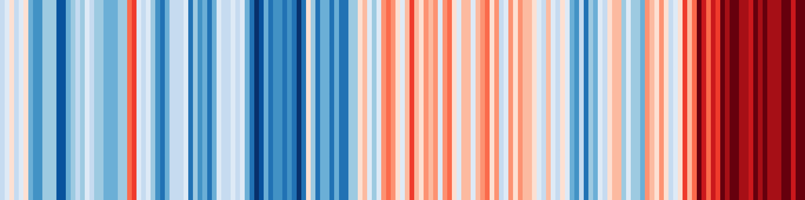

## Hi, I'm Jago

I'm currently a summer researcher and astrophysics student at the [University of Cambridge](https://cam.ac.uk) with a wide variety of interest.

This summer I have been investigating the potential growth of Kelp in the North Atlantic for the purpose of carbon sequestration. Code coming soon.

You may be interested in my slightly more aesthetically pleasing [website](https://jagosw.com), even if it is just as outdated. You can also email me at [jagoosw@protonmail.com](mail:jagoosw@protonmail.com).

Some stats:

And some of the things I've been doing recently (not including private repos):
<!--START_SECTION:activity-->
1. 💪 Opened PR [#3](https://github.com/jagoosw/Kelp.jl/pull/3) in [jagoosw/Kelp.jl](https://github.com/jagoosw/Kelp.jl)
2. 🗣 Commented on [#16](https://github.com/JuliaImages/ImageBase.jl/issues/16) in [JuliaImages/ImageBase.jl](https://github.com/JuliaImages/ImageBase.jl)
<!--END_SECTION:activity-->

[Get GitHub Pro for free if you're a student](https://education.github.com/pack)

