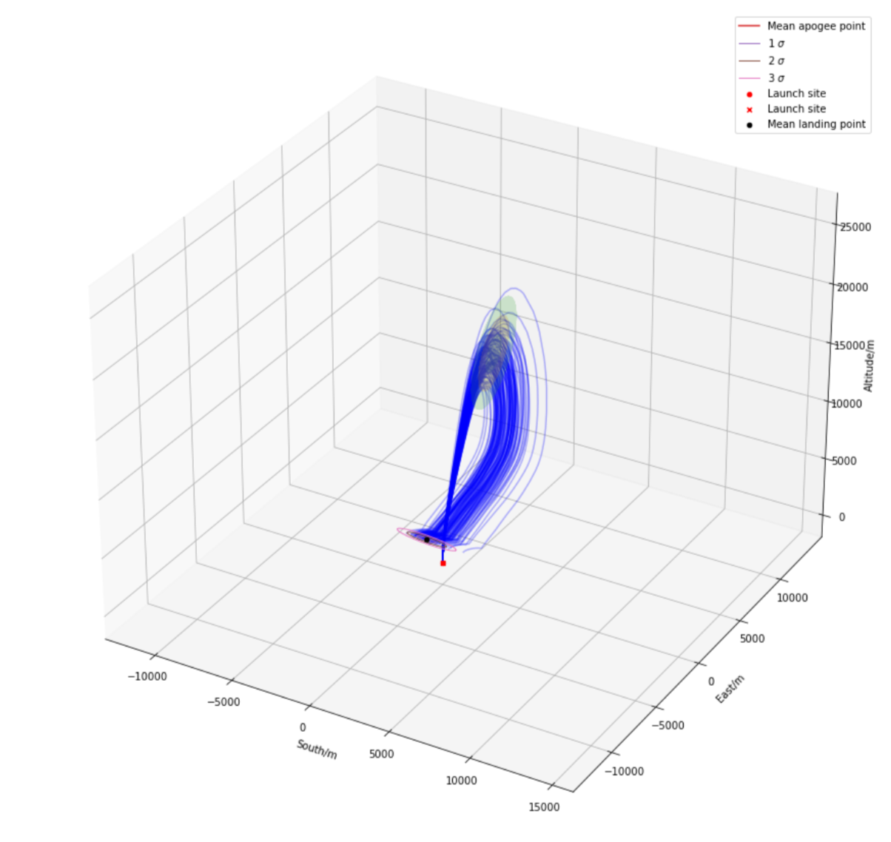
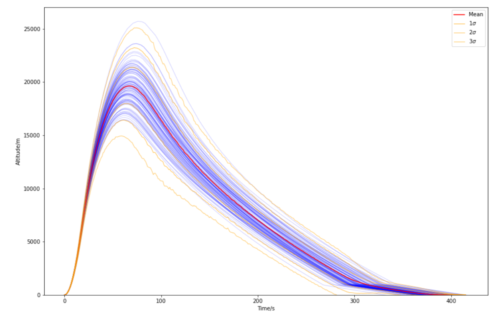

### Hi, I'm Jago and this is some of my work

<!--
**jagoosw/jagoosw** is a ✨ _special_ ✨ repository because its `README.md` (this file) appears on your GitHub profile.

Here are some ideas to get you started:

- 🔭 I’m currently working on ...
- 🌱 I’m currently learning ...
- 👯 I’m looking to collaborate on ...
- 🤔 I’m looking for help with ...
- 💬 Ask me about ...
- 📫 How to reach me: ...
- 😄 Pronouns: ...
- ⚡ Fun fact: ...
-->

I'm an astrophysics student at the [University of Cambridge](https://www.ast.cam.ac.uk/students/current.undergraduates/part.ii.astrophysics) with a wide variety of interest.

The main projects I am working on at the moment are a fully featured rocket trajectory simulation and computing assignments for my course. The rocket simulation is unique in including a Monte Carlo stochastic simulation including guassian process wind noise and will be available soon when preliminary documentation is complete. Heres a few plots from a previous version:

  
   

On top of my course I am currently leanring about statistical modeling of dynamic systems and dipping my toes in with atmospheric physics to the end of understanding climate change better.

My goals for 2021 are:
- Finish the rocket simulation and write a paper about it
- Do well on my course
- Improve my understanding and actions to help global warming
- Increasing my experiance of research and industrial applications of my skills

You can email me at [jagoosw@protonmail.com](mail:jagoosw@protonmail.com) and find me on [Twitter @jagosw](https://twitter.com/jagosw) which I seem to mainly use for contesting peoples false claims about COVID and climate change.

I can also be found:
- My website [jagosw.com](https://jagosw.com) which doesn't get updated very much
- 
-  where I mainly post astrophotography

Some stats (please note this doesn't include my current trajectory simulation project which has >8000 lines of code and >300 commits):

My recent activity (again excluding private repos):
<!--START_SECTION:activity-->
1. 🎉 Merged PR [#23](https://github.com/CUSF-Simulation/CamPyRoS/pull/23) in [CUSF-Simulation/CamPyRoS](https://github.com/CUSF-Simulation/CamPyRoS)
2. 💪 Opened PR [#23](https://github.com/CUSF-Simulation/CamPyRoS/pull/23) in [CUSF-Simulation/CamPyRoS](https://github.com/CUSF-Simulation/CamPyRoS)
3. 🗣 Commented on [#13442](https://github.com/scipy/scipy/issues/13442) in [scipy/scipy](https://github.com/scipy/scipy)
4. 💪 Opened PR [#13442](https://github.com/scipy/scipy/pull/13442) in [scipy/scipy](https://github.com/scipy/scipy)
5. 🗣 Commented on [#13492](https://github.com/ray-project/ray/issues/13492) in [ray-project/ray](https://github.com/ray-project/ray)
<!--END_SECTION:activity-->
